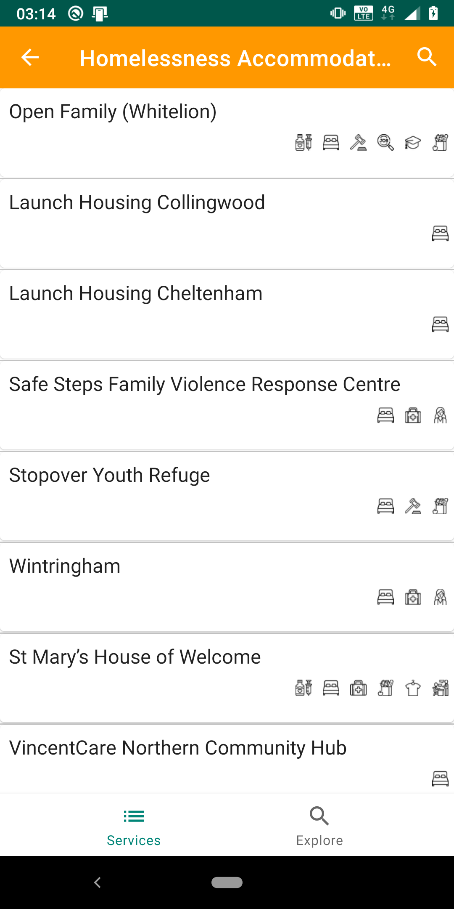

# HelpingOut-Melbourne

This is an unofficial app version of the "Helping Out Guide" available on City of Melbourne website. This app version of the guide is not endorsed by City Of Melbourne.

The Helping Out guide provides a comprehensive list of free and low-cost services available from organisations in the central city and surrounding suburbs.
It includes a map and information about food, accommodation, health services, drug and alcohol services, services for women and legal advice from more than 70 organisations throughout the city.

It help user to:
- Bring this guide to a wider audience
- Let people know about free or low-cost services available in Melbourne and surrounding suburbs to help them in the time of need
- Make it easy to navigate the guide which is not possible with printed version
- Allow users to search and filter places based on service type
- Visualise location of places on the map

Official Helping-Out Guide is available on City of Melbourne website @ https://www.melbourne.vic.gov.au/community/health-support-services/social-support/pages/helping-out.aspx

## Why I developed it?
- Practice MVVM design pattern
- Experiment with Google's new JetPack libraries

## Developed using:
- Kotlin
- Room for storing data
- Retrofit2 for REST API
- Kodein for dependency injection
- Groupie for recycleview adapters

Feel free to modify it or send me suggestions to improve it

Credit: Logo icon from Flaticon.com by author Freepik

## MIT License

Copyright (c) 2020 Umair Khan

Permission is hereby granted, free of charge, to any person obtaining a copy
of this software and associated documentation files (the "Software"), to deal
in the Software without restriction, including without limitation the rights
to use, copy, modify, merge, publish, distribute, sublicense, and/or sell
copies of the Software, and to permit persons to whom the Software is
furnished to do so, subject to the following conditions:

The above copyright notice and this permission notice shall be included in all
copies or substantial portions of the Software.

THE SOFTWARE IS PROVIDED "AS IS", WITHOUT WARRANTY OF ANY KIND, EXPRESS OR
IMPLIED, INCLUDING BUT NOT LIMITED TO THE WARRANTIES OF MERCHANTABILITY,
FITNESS FOR A PARTICULAR PURPOSE AND NONINFRINGEMENT. IN NO EVENT SHALL THE
AUTHORS OR COPYRIGHT HOLDERS BE LIABLE FOR ANY CLAIM, DAMAGES OR OTHER
LIABILITY, WHETHER IN AN ACTION OF CONTRACT, TORT OR OTHERWISE, ARISING FROM,
OUT OF OR IN CONNECTION WITH THE SOFTWARE OR THE USE OR OTHER DEALINGS IN THE
SOFTWARE.
